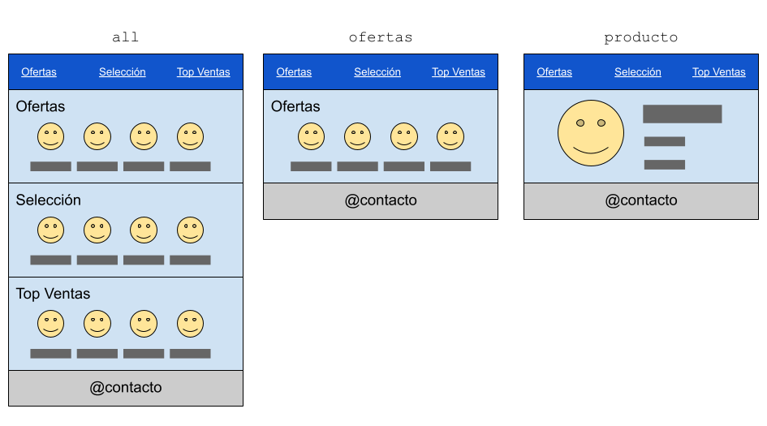

# Laravel Views

https://laravel.com/docs/11.x/views

Desarrolla una aplicación para mostrar un catálogo de productos.

La aplicación tendrá TRES catálogos diferentes, que mostrarán diferentes productos:

* Ofertas
* Selección
* Top-ventas

De cada producto se mostrará una `imagen`, una `descripción` y un `precio`. Los catálogos incluirán un enlace para ver en detalle un producto, con el parámetro `{productoid}`.


## Rutas

La apliacación tendra 5 rutas:

`GET /` 
Mostrará los tres catálogos

`GET /ofertas`
Mostrará el catálogo de ofertas

`GET /seleccion`
Mostará el catálogo de selección

`GET /top-ventas`
Mostrará el catálogo top ventas

`GET /producto/{productoid}`
Mostrará un producto concreto. Este producto puede ser de cualquiera de los tres catálogos


* Todas las rutas deben apuntar a un mismo Controlador

## Vistas

Se deberán crear:

* 3 vistas una para cada catálogo (`ofertas`, `seleccion`, `topventas`). Estas vistas mostrarán los productos.
* una vista (`all`) que incluirá (`@include`) las vistas de los 3 catálagos
* una vista (`producto`) para mostrar un producto 

Además, cada una de estas cinco vistas deberá incluir una barra superior con un enlace a cada catálogo, y una barra inferior con los datos de contacto de la tienda.



## Datos

Cada catálogo guardará sus productos en una variable diferente.

* `seleccion`:

  Guardará los productos en un string JSON, que se evaluará con `json_decode`

* `ofertas`

  Guardará los productos como un array asociativo

* `topventas`

  Guardará los productos en un array de objetos de clase `Producto`

Estas variables estarán definidas _simplemente_ en el controlador, y se definirá un método `init_variables()` para inicializarlas.

A continuación se muestra un esqueleto de como se podría hacer:

```php
class Product {
    public $name, $id;
 
    function __construct($name, $id) {
        $this->name = $name;
        $this->id = $id;
    }
 }

class ProductController extends Controller
{

    public $seleccion, $ofertas, $topventas;

    function init_variables() {

        // JSON String 
        $this->seleccion = json_decode('[
           { "name" : "producto seleccion 1", "id" : 991},
           { "name" : "producto seleccion 2", "id" : 992}
        ]');

        // Array asociativo
        $this->ofertas = [
            [ "name" => "producto oferta 1", "id" => 993],
            [ "name" => "producto oferta 2", "id" => 994]
        ];

        // Array de objetos
        $this->topventas = [
            new Product("producto top 1", 995),
            new Product("producto top 2", 996)
        ];
    }


    // ...resto de metodos menejadores de rutas...
}

```

