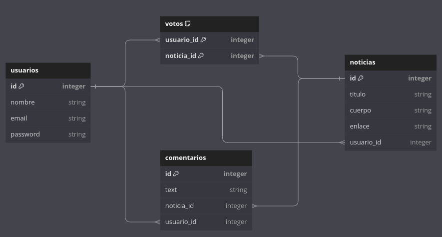

# Laravel Relationships

Crea un agregador de noticias que permita a los usuarios:

* Registrarse / login
* Enviar noticias
* Ver la lista de noticias
* Ver una noticia
* Votar noticias
* Comentar noticias

Utiliza Laravel Breeze para la gestión de usuarios: https://laravel.com/docs/11.x/starter-kits#laravel-breeze

El esquema de la base de datos puede ser similar a este:

