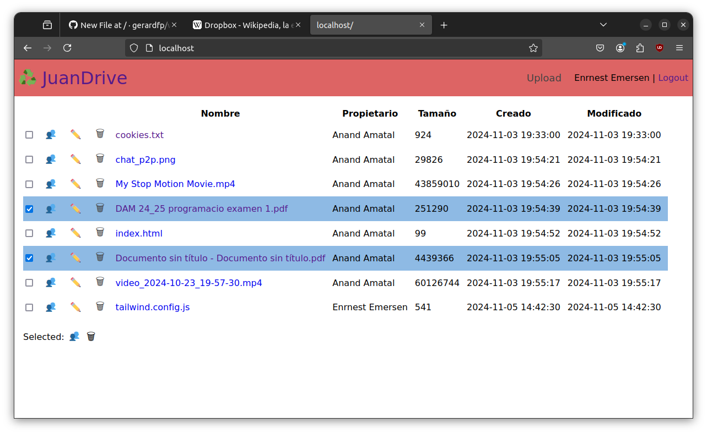

# ♻️ JuanDrive File manager


## Create Laravel Project
_MySQL is not necessary_

```bash
curl -s "https://laravel.build/a5-app?with=mysql" | bash
```

## Copy files
```bash
#copy files
```

## Run the containers
```bash
vendor/bin/sail up
```

## Migrate database schema
```bash
vendor/bin/sail php artisan migrate:fresh --seed
```


