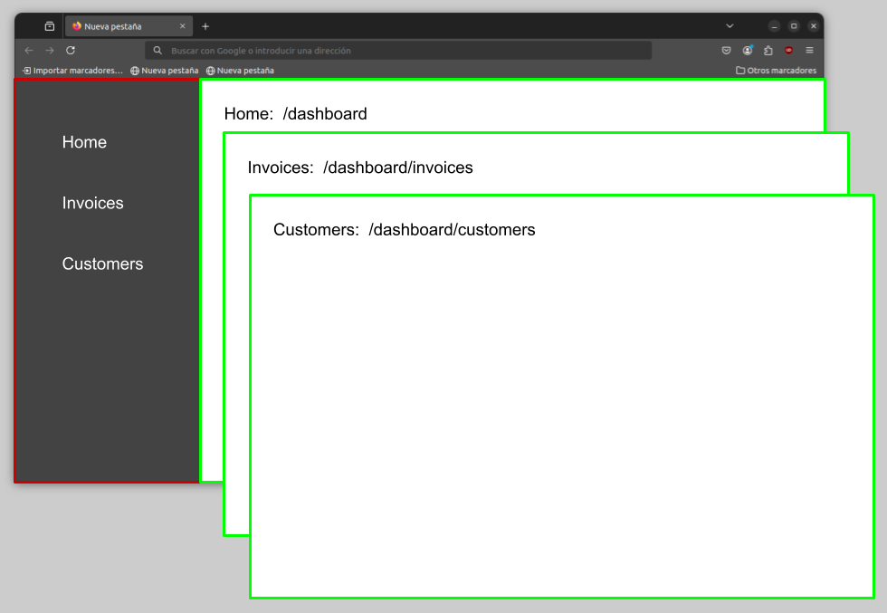

# learn nextjs

https://nextjs.org/learn

# Chapter 0

Crea una carpeta para el proyecto y ábrela en un Dev Container (Node-js & Typescript) con Visual Studio Code.

# Chapter 1

Crea un proyecto Next.js **vacío** con las **opciones por defecto**, e inícialo:

```bash
npx create-next-app@latest a6-nextjs-tutorial --empty --yes

cd a6-nextjs-tutorial

pnpm run dev
```

# Chapter 2

Instala las librerías `clsx` y `@heroicons/react`:

```bash
pnpm i clsx @heroicons/react
```

<br />

Utiliza la librería `clsx` para dar _formato condicional_ a un componente:

* Crea un componente `app/ui/EstadoFactura.tsx` que recibe un un _prop_ llamado `estado` que puede ser `pagada` o `pendiente`.

    El componente retornará un `<span>` con:

    * _Display_ tipo `inline-flex`
    * Alineación `items-center` 
    * Esquinas redondadas
    * Padding horizontal de `8px`
    * Padding vertical de `4px`
    * Color texto:
        * `gray-500` si el estado es `pendiente`
        * blanco si el estado es `pagada`
    * Color de fondo:
        * `gray-100` si el estado es `pendiente`
        * `green-500` si el estado es `pagada`
    * Texto:
        * `Pendiente` si el estado es `pendiente`
        * `Pagada` si el estado es `pagada`
    * Icono:
        * Margen izquierdo `4px`
        * Ancho `16px` 
        * `<ClockIcon>` si el estado es `pendiente`
        * `<CheckIcon>` si el estado es `pagada`
        * Color texto:
            * `gris-500` si el estado es `pendiente`
            * blanco si el estado es `pagada`
        
* Añade en la página principal `app/page.tsx` un componente de cada tipo

# Chapter 3

Crea un componente que utilice diversas fuentes e imagenes.

# Chapter 4

Crea una estructura de rutas como la que se muestra en la imagen.

Deberás crear un `layout.tsx` con el menu para las rutas que cuelgan de `/dashboard`.

Crea el menú en un componente separado: `/app/ui/SideNav.tsx`.



# Chapter 5

Añade los enlaces de navegación al menú. Utiliza el componente `Link` para hacer _client-side navigation_.


Utiliza el _hook_ `usePathName()` para resaltar el enlace activo.

# Chapter 6

Quirks:
https://github.com/gerardfp/slolingo/tree/main

`/openssl.cnf`:
```
nodejs_conf = openssl_init

[openssl_init]
ssl_conf = ssl_sect

[ssl_sect]
system_default = system_default_sect

[system_default_sect]
Options = UnsafeLegacyRenegotiation
```

`vercel.json`:
```
{
    "devCommand": "NODE_TLS_REJECT_UNAUTHORIZED=0 NODE_OPTIONS='--openssl-config=openssl.cnf' next dev"
}
```
`package.json`
```
"s`ed": "NODE_TLS_REJECT_UNAUTHORIZED=0 node --openssl-config=openssl.cnf -r dotenv/config ./scripts/seed.js"
```